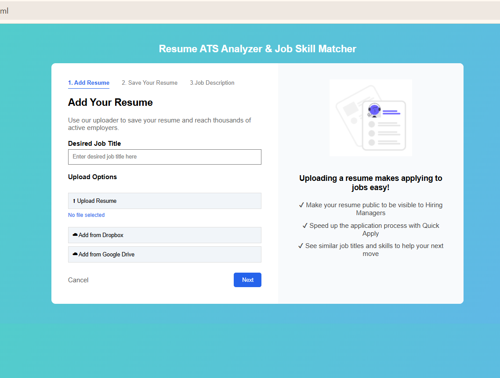
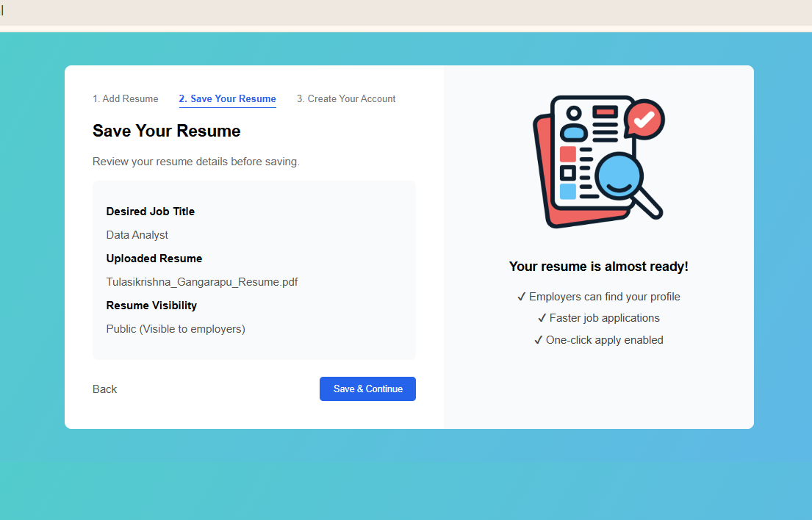
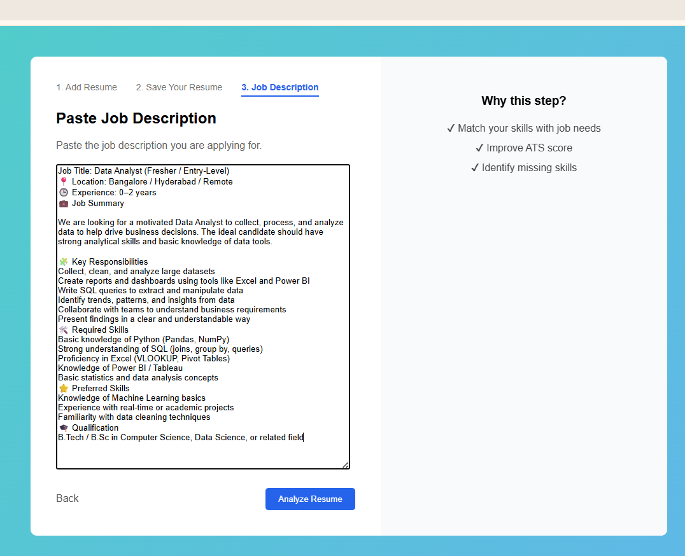
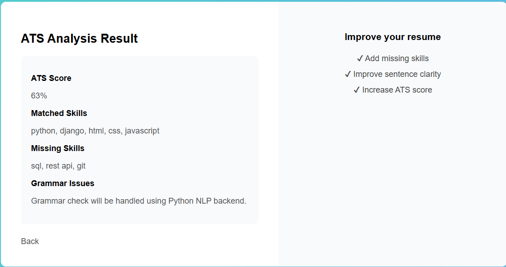

# Resume ATS Analyzer & Job Skill Matcher(Frontend Prototype)

This project is a frontend prototype of an Applicant Tracking System (ATS) that analyzes resumes against job descriptions and highlights skill matches and gaps.

## 🚀 Features
- Resume upload with validation
- Job title input with autocomplete
- Multi-step user flow (Add Resume → Save Resume → Job Description → Result)
- ATS score calculation (frontend logic)
- Matched and missing skills display
- Professional UI similar to real job portals

## 🛠 Tech Stack
- HTML
- CSS
- JavaScript

## 📌 Project Status
- ✅ Frontend completed
- 🔧 Backend (Python & Django) planned
- 🔧 Database & APIs planned

## 🧠 How It Works
1. User uploads resume and enters job title
2. Resume details are reviewed
3. User pastes job description
4. ATS score and skill matching results are displayed

## 🎥 Project Demo Video

▶️ Watch the project demo on LinkedIn:
[▶️ Watch Demo Video on LinkedIn](https://www.linkedin.com/posts/tulasikrishna-gangarapu-06850b304_frontenddevelopment-javascript-webdevelopment-activity-7419346396950081536-K5gm?utm_source=share&utm_medium=member_desktop&rcm=ACoAAE2shpABTRJwf89PqpPdpzj1Z5yIAdhgSQ4)

## 📸 Project Screenshots

### 1️⃣ Add Resume

### 2️⃣ Save Your Resume

### 3️⃣ Job Description

### 4️⃣ ATS Result

## 📈 Future Enhancements
- Django backend integration
- Resume text extraction (PDF/DOCX)
- Real ATS scoring using Python
- Grammar checking using NLP
- Database integration

## 👤 Author
Gangarapu Tulasikrishna
