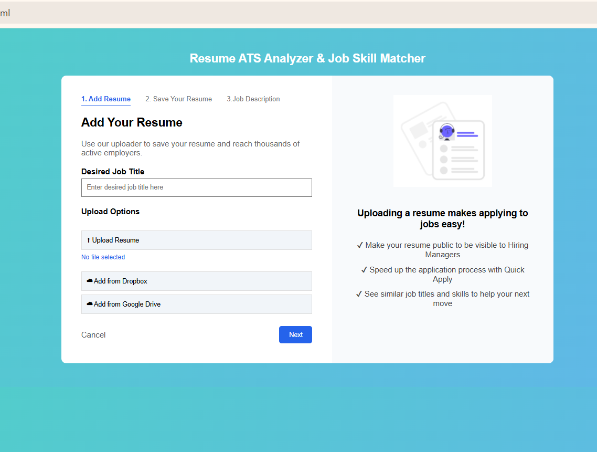
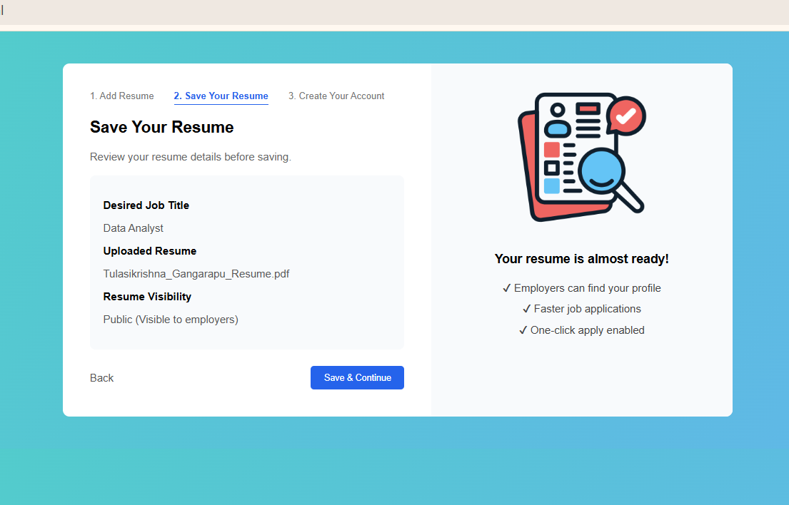
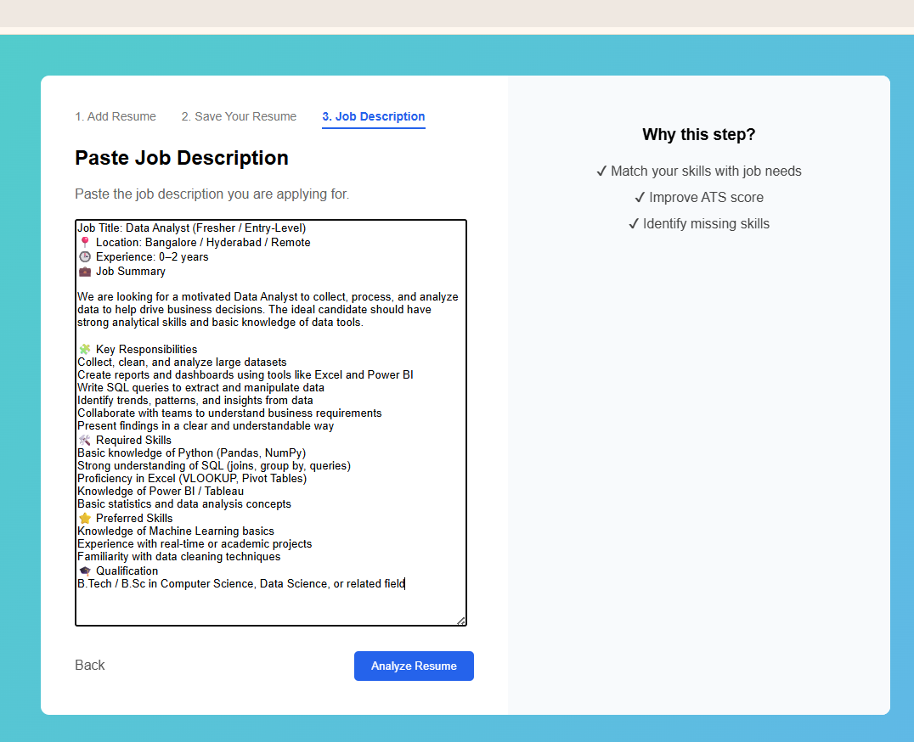
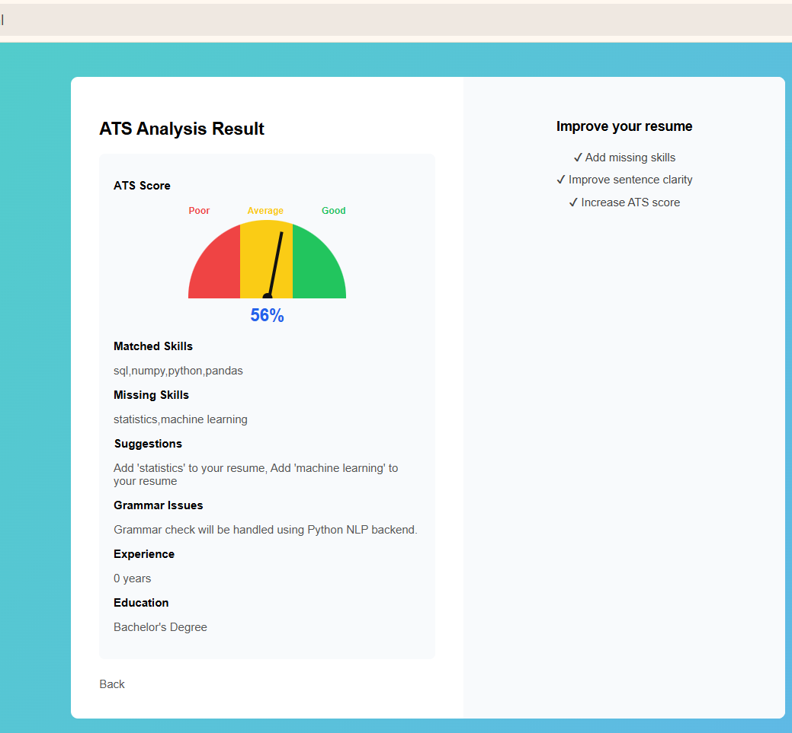

# Resume ATS Analyzer & Job Skill Matcher

A full-stack web application that analyzes resumes against job descriptions and generates an ATS (Applicant Tracking System) score with actionable insights such as matched skills, missing skills, and improvement suggestions using NLP techniques.

## 🚀 Features
📄 Upload resume (PDF/DOCX)
🧠 NLP-based skill extraction (spaCy)
📊 Match resume with job description
🎯 ATS score calculation (weighted logic)
✅ Display matched skills
❌ Identify missing skills
💡 Provide improvement suggestions
🧑‍💼 Extract experience (years)
🎓 Detect education level
🌐 REST API integration using Django
🔁 Multi-step user workflow (Upload → Analyze → Result)

🛠 Tech Stack
Frontend
HTML
CSS
JavaScript
Backend
Python
Django
Django REST Framework
Libraries
spaCy (NLP)
PyPDF2 / python-docx

## 🧠 How It Works
User uploads resume
Backend extracts text from resume (PDF/DOCX)
NLP processes resume & job description
Skills are matched and missing skills identified
ATS score is calculated
Suggestions are generated

## 🎥 Project Demo Video

▶️ Watch the project demo on LinkedIn:
[▶️ Watch Demo Video on LinkedIn](https://www.linkedin.com/posts/tulasikrishna-gangarapu-06850b304_python-django-fullstack-activity-7446516988316925952-d3m_?utm_source=share&utm_medium=member_desktop&rcm=ACoAAE2shpABTRJwf89PqpPdpzj1Z5yIAdhgSQ4)

## 📸 Project Screenshots

### 1️⃣ Add Resume

### 2️⃣ Save Your Resume

### 3️⃣ Job Description

### 4️⃣ ATS Result

## 📈 Future Enhancements
User uploads resume
Backend extracts text from resume (PDF/DOCX)
NLP processes resume & job description
Skills are matched and missing skills identified
ATS score is calculated
Suggestions are generated

## 👤 Author
Gangarapu Tulasikrishna
